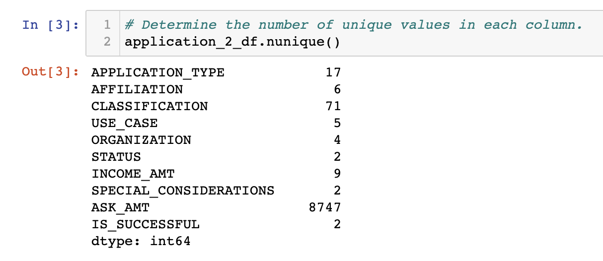
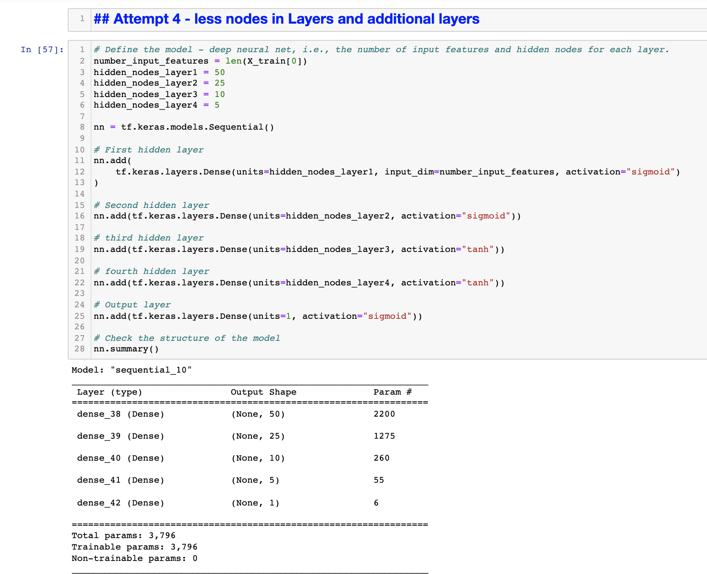
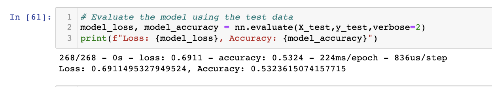

# Neural_Network_Charity Overview of the analysis:
In this analysis we used deep learning Machine Learning and multiple iterations of Neural Networks models using the TensorFlow platform in Python in an attempt to accurately predict which of the charities should receive funds from the Foundation. 

## Methods
In this analysis we employed the following methods:
- preprocessed and cleaned the data by eliminating variables that were unnecessary and making all categorical data into numerical or binary data.
- compiled, trained, and evaluated the model. 
- completed multiple iterations of the model with various changes in an attempt to optimize the neural network model to increase accuracy and reduce loss. 

## Results: 

### Data Preprocessing
- The 'IS_SUCCESSFUL' variable was considered the target for our model. This variable was a binary input that indicated whether the charity had used previous funds successfully. 
- We removed the 'EIN' and 'NAME' variable from the input dataset because that information would not improve the deep learning model. 
- The remaining variables were considered to be the features for your model. These variables included 'APPLICATION_TYPE', 'AFFILIATION', 'CLASSIFICATION', 'USE_CASE', 'ORGANIZATION', 'STATUS', 'INCOME_AMT', 'SPECIAL_CONSIDERATIONS', 'ASK_AMT'.

### Compiling, Training, and Evaluating the Model
- The original deep learning neural network model was made of two hidden layers with 80 neurons in the first hidden layer and 30 neurons in the second hidden layer. The input data has 43 features. The output layer is made of a unique neuron as it is a binary classification. We used the ReLU activation function for the hidden layers. Since our output is a binary classification, we used the Sigmoid activation function for the output layer.

- Our original model performed less than optimally with an accuracy of 62.5% and a Loss of 65.5%. We would prefer the model have an accuracy of more than 75%, so additional adjustments were made in an attempt to improve accuracy. 

- In subsequent model iterations, various changes were made to the model in an attempt to improve the accuracy. First the number of nodes in each layer was increased. This did not work and the Accuracy went down to 53.3% with a loss of 69.1%. Next an additional hidden layer was added that also used the "ReLU" activation function and contained 15 nodes. This did not change the model much at all as the Accuracy stayed at 53.3% with a loss of 69.1%. After this second attempt, additional changes that were made were to reduce the nodes and increase the hidden layers to 4, and increase the number of nodes, increase hidden layers to 5 and use different activation function ("sigmoid" and "tanh"). With all five attempts to improve the model, the accuracy did not improve significantly. 

## Summary: 
In our deep learning model we were unable to succeed in finding a model that had an classification accuracy that was over 75%. The highest accuracy one of our models was able to achieve was 53%. This is barely better than guessing, so the deep-learning model would need to be more improved before it should be used to predict any outcomes. 

Some ways that this model could be improved would be to perform analysis on the input data to see if there are any other feature that do not contribute to the accuracy of the classifications. Additionally, the activation functions for the hidden layers could be changed to see if they are able to produce better accuracy.  Another option would be to attempt a Random Forest Classifier model for the data to see if it is more accurate in predicting outcomes. This would utilize less processing power and may be a better option if it is more accurate than our current models.  

